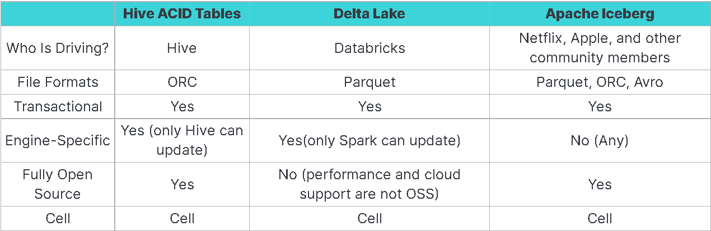

# Enter Apache Iceberg

- Iceberg - What?
    - created by Netflix & Apple
    - 100% open-source
    - supports common standard file formats (parquet, avro, orc)
    - supported by common data lake engines (spark, hive, presto, dremio)
    - transactional consistency
        - data modification can occur concurrently with isolation
    - schema evolution
    - time travel for querying historical data
    - partition layout and evolution
    - rollback to prior versions
- Iceberg - How?
    - uses manifests that track snapshots of the data over time i.e deltas of the table
    - optimizes performance using a hierarchial structure of the manifests
    - stores the full history without dependencies, enabling an open architecture (no tool or engine dependencies)
- Alternative Comparison
